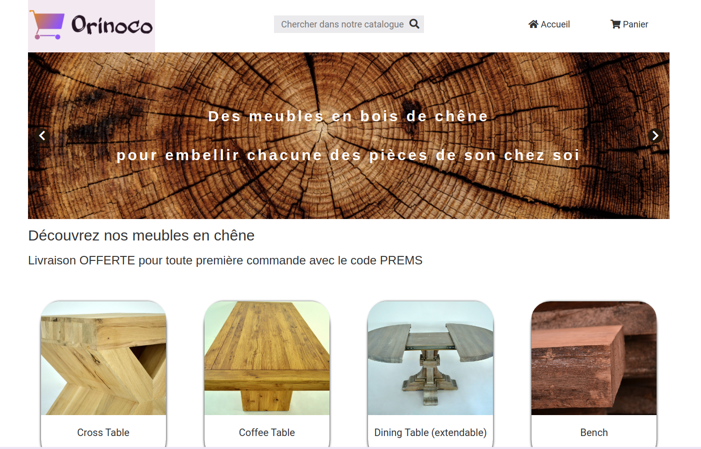

<h1 align="center">Orinoco</h1>

  OpenClassrooms Project for The <a href="https://openclassrooms.com/en/paths/141-web-developer#path-tabs" target="_blank">Web Developer Training Programm</a>.

<!-- TABLE OF CONTENTS -->

## Table of Contents

- [Overview](#overview)
- [Built With](#built-with)
- [Features](#features)
- [Contact](#contact)

<!-- OVERVIEW -->

## Overview

The website is not online, one most download the repo and run 'node server' to see the application. 

### Built With

<!-- This section should list any major frameworks that you built your project using. Here are a few examples.-->
- [HTML5] (https://html.com/)
- [CSS3] (https://www.w3.org/Style/CSS/Overview.en.html)
- [Sass] (https://sass-lang.com/)
- [JavaScript] (https://www.javascript.com/)

## Features

<!-- List the features of your application or follow the template. Don't share the figma file here :) -->

This website was created as a submission to a project, part of a Training Programm. The challenge was to build an e-commerce application. 

## Contact

- GitHub [@LKurdi292](https://{github.com/lkurdi292})
- Mail [kurdilora@gmail.com]
